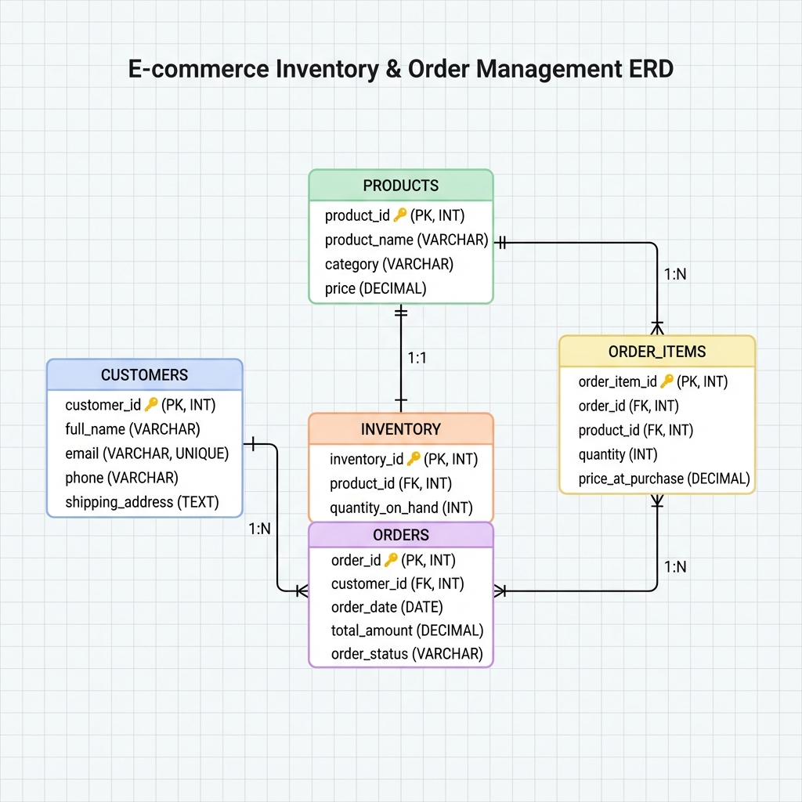

# SQL Inventory and Order Management System

## Project Overview

A complete, normalized (3NF) relational database system for e-commerce inventory and order management. This capstone project demonstrates advanced SQL skills including database design, DDL, complex queries with window functions, views, and stored procedures.

**Status:** In Progress

---


---

## Project Structure


sql/
├── erd_diagram.png          # Visual database schema
├── schema_ddl.sql           # Database creation script (DDL)
├── sample_data.sql          # Sample test data
├── queries_dml.sql          # KPIs, analytics, views, procedures (DML)
└── README.md                # This file
```

---

## Database Schema

### Tables

1. **Customers** - Customer information and contact details
2. **Products** - Product catalog with categories and pricing
3. **Inventory** - Stock level tracking
4. **Orders** - Customer orders with status tracking
5. **Order_Items** - Bridge table (many-to-many: Orders ↔ Products)

### Entity-Relationship Diagram



### Key Relationships

- Customers → Orders (1:N)
- Orders → Order_Items (1:N)
- Products → Order_Items (1:N)
- Products → Inventory (1:1)

---

## Quick Start

### Prerequisites

- MySQL 8.0+ or MariaDB 10.5+
- Database client (MySQL Workbench, DBeaver, or command line)

### Installation

---

## Features

### Data Integrity
- **Primary Keys:** AUTO_INCREMENT on all tables
- **Foreign Keys:** Referential integrity with CASCADE/RESTRICT
- **CHECK Constraints:** Non-negative prices and quantities
- **NOT NULL:** Essential fields enforced
- **UNIQUE:** Email addresses, 1:1 relationships

### Business Analytics
- Total revenue calculations
- Customer spending rankings
- Best-selling products analysis
- Monthly sales trends
- Category performance metrics

### Advanced SQL Techniques
- **Window Functions:** RANK(), LAG(), ROW_NUMBER()
- **Views:** Pre-calculated CustomerSalesSummary
- **Stored Procedures:** Transaction-based order processing
- **Complex Joins:** Multi-table aggregations
- **Error Handling:** Comprehensive validation

---

## Sample Queries

### Total Revenue
```sql
SELECT SUM(total_amount) AS total_revenue
FROM Orders
WHERE order_status IN ('Shipped', 'Delivered');
```

### Top 10 Customers
```sql
SELECT c.full_name, SUM(o.total_amount) AS total_spent
FROM Customers c
JOIN Orders o ON c.customer_id = o.customer_id
GROUP BY c.customer_id
ORDER BY total_spent DESC
LIMIT 10;
```

### Product Rankings by Category
```sql
SELECT category, product_name,
       RANK() OVER (PARTITION BY category ORDER BY revenue DESC) AS rank
FROM (SELECT p.category, p.product_name, 
             SUM(oi.quantity * oi.price_at_purchase) AS revenue
      FROM Products p
      JOIN Order_Items oi ON p.product_id = oi.product_id
      GROUP BY p.category, p.product_name) ranked;
```

---

## Stored Procedures

### ProcessNewOrder
Process a new order with automatic inventory management.

**Usage:**
```sql
CALL ProcessNewOrder(customer_id, product_id, quantity);
```

**Features:**
- Transaction-based (ACID compliant)
- Inventory validation
- Automatic stock reduction
- Error handling with rollback
- Descriptive error messages

**Example:**
```sql
-- Successful order
CALL ProcessNewOrder(1, 5, 2);

-- Insufficient inventory (will fail gracefully)
CALL ProcessNewOrder(1, 5, 1000);
```

---

## Sample Data

The database includes realistic test data:

| Entity | Count | Description |
|--------|-------|-------------|
| Customers | 20 | Complete contact information |
| Products | 25 | 5 categories (Electronics, Apparel, Books, Home & Garden, Sports) |
| Inventory | 25 | Stock levels 27-150 units |
| Orders | 30 | Pending (5), Shipped (5), Delivered (20) |
| Order Items | 67 | Realistic shopping patterns |

---

##  Learning Outcomes

This project demonstrates mastery of:

- **Database Design:** ERD creation, normalization (3NF)
- **DDL:** CREATE TABLE with constraints and indexes
- **DML:** Complex SELECT queries with aggregations
- **Window Functions:** RANK, LAG, ROW_NUMBER, PARTITION BY
- **Views:** Performance optimization
- **Stored Procedures:** Transaction management, error handling
- **Data Integrity:** Constraints, validation, referential integrity

---

## Project Requirements

### Phase 1: Database Design 
- Entity-Relationship Diagram
- 3NF normalization
- Relationship mapping

### Phase 2: Schema Implementation 
- CREATE TABLE statements
- Primary and foreign keys
- CHECK and NOT NULL constraints

### Phase 3: Advanced Querying 
- Business KPIs (revenue, top customers, best products)
- Window functions (rankings, lag analysis)
- Views and stored procedures

---

#
## 🔗 Related Files

- **ERD Diagram:** [erd_diagram.png](erd_diagram.png)
- **DDL Script:** [schema_ddl.sql](schema_ddl.sql)
- **Sample Data:** [sample_data.sql](sample_data.sql)
- **DML Queries:** [queries_dml.sql](queries_dml.sql)

---


