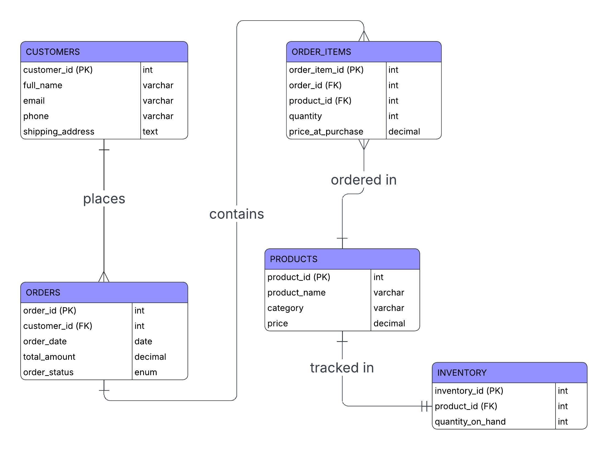

# Inventory and Order Management System

A production-ready, enterprise-level relational database for e-commerce inventory and order management. This project demonstrates advanced SQL skills including normalized database design (3NF), comprehensive data integrity constraints, audit logging, and performance optimization.

---

## Table of Contents

- [Project Overview](#project-overview)
- [Features](#features)
- [Database Schema](#database-schema)
- [Schema Constraints and Integrity Rules](#schema-constraints-and-integrity-rules)
- [Audit System](#audit-system)
- [Installation](#installation)
- [Usage](#usage)
- [Views](#views)
- [Stored Procedures](#stored-procedures)
- [Sample Queries](#sample-queries)
- [Project Structure](#project-structure)
- [Technical Specifications](#technical-specifications)

---

## Project Overview

This capstone project implements a complete database solution for an e-commerce company's inventory and order management system. It covers the full database lifecycle from design to implementation to analytics.

### Key Objectives

- **Database Design**: Normalized 3NF relational schema with ERD
- **Data Integrity**: Comprehensive constraints (PK, FK, UNIQUE, CHECK, NOT NULL) with ON DELETE/UPDATE rules
- **Audit Logging**: Full traceability of all inventory changes via triggers and dedicated audit table
- **Performance**: Optimized with 17 indexes and 7 pre-calculated views
- **Analytics**: Business KPIs, window function queries, and stored procedures

---

## Features

### Data Integrity

| Feature | Implementation |
|---------|---------------|
| Primary Keys | AUTO_INCREMENT on all 6 tables |
| Foreign Keys | ON DELETE/UPDATE rules (CASCADE, RESTRICT, SET NULL) for referential integrity |
| UNIQUE Constraints | Email addresses, product names, inventory-product mapping, order-product combinations |
| CHECK Constraints | 10 constraints validating prices, quantities, email format, statuses, and categories |
| NOT NULL | All essential fields enforced across every table |
| Timestamps | `created_at`/`updated_at` on all main tables for record lifecycle tracking |

### Enterprise Features

- **Audit Logging**: Automatic tracking of all inventory changes via 3 database triggers
- **Transaction Safety**: ACID-compliant stored procedures with rollback on failure
- **Soft Delete**: `is_active` flag on Products to preserve referential integrity
- **Performance Indexes**: 17 indexes for query optimization across all tables
- **7 Reporting Views**: Pre-calculated analytics for fast reporting
- **2 Stored Procedures**: Order processing and inventory restocking with audit integration

---

## Database Schema

### Entity-Relationship Diagram



### Tables Overview

| Table | Description | Records |
|-------|-------------|---------|
| `Customers` | Customer information with unique email and format validation | 20 |
| `Products` | Product catalog with unique names and category enforcement | 25 |
| `Inventory` | Stock levels with reorder thresholds (1:1 with Products) | 25 |
| `Orders` | Customer orders with status tracking and date validation | 30 |
| `Order_Items` | Bridge table linking Orders to Products (many-to-many) | 67 |
| `Inventory_Audit` | Audit log for all inventory changes | Dynamic |

### Key Relationships

```
Customers --(1:N)--> Orders --(1:N)--> Order_Items <--(N:1)-- Products
                                                                  |
                                         Inventory <--(1:1)------+
                                             |
                                             v
                                      Inventory_Audit
```

---

## Schema Constraints and Integrity Rules

### UNIQUE Constraints

| Table | Column(s) | Purpose |
|-------|-----------|---------|
| `Customers` | `email` | Prevents duplicate customer accounts |
| `Products` | `product_name` | Ensures no two products share the same name |
| `Inventory` | `product_id` | Enforces one-to-one relationship with Products |
| `Order_Items` | `(order_id, product_id)` | Prevents duplicate product entries within a single order |

### CHECK Constraints

| Constraint Name | Table | Rule | Purpose |
|----------------|-------|------|---------|
| `chk_email_format` | Customers | `email LIKE '%_@_%.__%'` | Validates basic email format (must contain `@` and domain) |
| `chk_price` | Products | `price >= 0` | Prevents negative product prices |
| `chk_category` | Products | `category IN ('Electronics', 'Apparel', 'Books', 'Home & Garden', 'Sports')` | Restricts categories to predefined valid values |
| `chk_quantity` | Inventory | `quantity_on_hand >= 0` | Prevents negative stock levels |
| `chk_reorder_level` | Inventory | `reorder_level >= 0` | Ensures reorder threshold is non-negative |
| `chk_total_amount` | Orders | `total_amount >= 0` | Prevents negative order totals |
| `chk_order_status` | Orders | `order_status IN ('Pending', 'Processing', 'Shipped', 'Delivered', 'Cancelled')` | Restricts orders to valid lifecycle statuses |
| `chk_item_quantity` | Order_Items | `quantity > 0` | Ensures at least 1 unit is ordered |
| `chk_item_price` | Order_Items | `price_at_purchase >= 0` | Prevents negative purchase prices |
| `chk_discount` | Order_Items | `discount_amount >= 0` | Prevents negative discount values |

### Foreign Key Cascade Rules (ON DELETE/ON UPDATE)

| Relationship | ON DELETE | ON UPDATE | Rationale |
|--------------|-----------|-----------|-----------|
| Inventory -> Products | CASCADE | CASCADE | Delete/update inventory when product is removed/changed |
| Orders -> Customers | RESTRICT | CASCADE | Protect order history; cannot delete a customer with orders |
| Order_Items -> Orders | CASCADE | CASCADE | Remove line items when an order is deleted |
| Order_Items -> Products | RESTRICT | CASCADE | Protect order history; cannot delete a product that has been ordered |
| Inventory_Audit -> Products | CASCADE | - | Clean up audit records when product is deleted |
| Inventory_Audit -> Orders | SET NULL | - | Preserve audit trail even if the related order is deleted |

---

## Audit System

All inventory changes are automatically logged to the `Inventory_Audit` table via database triggers, providing full traceability for enterprise compliance.

### Tracked Actions

| Action Type | Trigger | Description |
|-------------|---------|-------------|
| `INSERT` | `trg_inventory_audit_insert` | New inventory record created for a product |
| `UPDATE` | `trg_inventory_audit_update` | Stock quantity changed (only logs if quantity differs) |
| `DELETE` | `trg_inventory_audit_delete` | Inventory record removed |
| `ORDER` | `ProcessNewOrder` procedure | Stock reduced to fulfill a customer order |
| `RESTOCK` | `RestockInventory` procedure | Stock replenished by warehouse |
| `ADJUSTMENT` | Manual entry | Ad-hoc inventory corrections |

### Audit Log Fields

| Field | Type | Description |
|-------|------|-------------|
| `audit_id` | INT (PK) | Unique audit record identifier |
| `product_id` | INT (FK) | Affected product |
| `action_type` | ENUM | Type of inventory change |
| `old_quantity` | INT | Stock level before the change |
| `new_quantity` | INT | Stock level after the change |
| `quantity_change` | INT | Delta amount (+/-) |
| `change_reason` | VARCHAR(255) | Description of why the change occurred |
| `changed_by` | VARCHAR(100) | User/system that initiated the change |
| `changed_at` | TIMESTAMP | When the change occurred |
| `related_order_id` | INT (FK) | Link to the order that triggered the change (if applicable) |
| `ip_address` | VARCHAR(45) | Source IP for security tracing |

### Query Audit History

```sql
-- View all inventory changes for a specific product
SELECT * FROM InventoryAuditSummary
WHERE product_id = 3
ORDER BY changed_at DESC;

-- View all changes in the last 7 days
SELECT * FROM Inventory_Audit
WHERE changed_at >= DATE_SUB(NOW(), INTERVAL 7 DAY)
ORDER BY changed_at DESC;

-- Summary of actions by type
SELECT action_type, COUNT(*) AS total_actions
FROM Inventory_Audit
GROUP BY action_type
ORDER BY total_actions DESC;
```

---

## Installation

### Prerequisites

- **MySQL 8.0+** or **MariaDB 10.5+**
- Database client (MySQL Workbench, DBeaver, or CLI)

### Step-by-Step Setup

1. **Clone the repository**
   ```bash
   git clone <repository-url>
   cd Inventory-and-Order-Management-System
   ```

2. **Create the database and schema**
   ```bash
   mysql -u root -p < schema_ddl.sql
   ```

3. **Load sample data**
   ```bash
   mysql -u root -p inventory_management < sample_data.sql
   ```

4. **Create views, triggers, and stored procedures**
   ```bash
   mysql -u root -p inventory_management < queries_dml.sql
   ```

### Verification

Run the following to verify installation:

```sql
USE inventory_management;

-- Check all tables exist
SHOW TABLES;

-- Verify record counts
SELECT 'Customers' AS table_name, COUNT(*) AS records FROM Customers
UNION ALL SELECT 'Products', COUNT(*) FROM Products
UNION ALL SELECT 'Inventory', COUNT(*) FROM Inventory
UNION ALL SELECT 'Orders', COUNT(*) FROM Orders
UNION ALL SELECT 'Order_Items', COUNT(*) FROM Order_Items
UNION ALL SELECT 'Inventory_Audit', COUNT(*) FROM Inventory_Audit;

-- Check views
SHOW FULL TABLES WHERE Table_type = 'VIEW';

-- Check stored procedures
SHOW PROCEDURE STATUS WHERE Db = 'inventory_management';

-- Check triggers
SHOW TRIGGERS;
```

---

## Usage

### Views

| View | Purpose |
|------|---------|
| `CustomerSalesSummary` | Pre-calculated customer spending metrics with VIP classification |
| `InventoryAuditSummary` | Audit log enriched with product details and order references |
| `ProductInventoryStatus` | Stock levels with status indicators (LOW/CRITICAL/ADEQUATE) and inventory value |
| `OrderDetailsSummary` | Complete order information with customer and item breakdowns |
| `MonthlySalesReport` | Aggregated monthly revenue, order counts, and customer metrics |
| `CategoryPerformance` | Sales metrics grouped by product category |
| `LowStockAlert` | Products at or near reorder level with sales velocity data |

**Examples:**

```sql
-- View customer analytics (VIP customers)
SELECT * FROM CustomerSalesSummary WHERE customer_status = 'VIP';

-- Check low stock products needing reorder
SELECT * FROM LowStockAlert;

-- Monthly revenue report
SELECT * FROM MonthlySalesReport ORDER BY year DESC, month DESC;

-- Product stock status dashboard
SELECT * FROM ProductInventoryStatus WHERE stock_status = 'CRITICAL';

-- Category performance comparison
SELECT * FROM CategoryPerformance ORDER BY total_revenue DESC;
```

### Stored Procedures

#### ProcessNewOrder

Process a new order with automatic inventory management and audit logging.

```sql
CALL ProcessNewOrder(customer_id, product_id, quantity, changed_by);

-- Example: Customer 1 orders 2 units of Product 3
CALL ProcessNewOrder(1, 3, 2, 'SALES_REP');
```

**Features:**
- Transaction-based (ACID compliant)
- Validates customer exists and is valid
- Validates product exists and is active
- Checks sufficient stock availability
- Automatically reduces inventory quantity
- Creates Order and Order_Items records
- Logs change to `Inventory_Audit` with order reference
- Returns detailed success or error message
- Rolls back entirely on failure

#### RestockInventory

Add stock to a product with audit logging.

```sql
CALL RestockInventory(product_id, quantity, changed_by);

-- Example: Add 50 units to Product 5
CALL RestockInventory(5, 50, 'WAREHOUSE_MGR');
```

**Features:**
- Validates product exists
- Updates `quantity_on_hand` and `last_restock_date`
- Logs restock action to `Inventory_Audit`
- Returns confirmation with old and new quantities

---

## Sample Queries

### Business KPIs

```sql
-- KPI 1: Total Revenue (completed orders only)
SELECT SUM(total_amount) AS total_revenue,
       COUNT(*) AS completed_orders,
       ROUND(AVG(total_amount), 2) AS avg_order_value
FROM Orders
WHERE order_status IN ('Shipped', 'Delivered');

-- KPI 2: Top 10 Customers by spending
SELECT c.full_name, COUNT(DISTINCT o.order_id) AS total_orders,
       SUM(o.total_amount) AS total_spent
FROM Customers c
JOIN Orders o ON c.customer_id = o.customer_id
WHERE o.order_status NOT IN ('Cancelled')
GROUP BY c.customer_id
ORDER BY total_spent DESC
LIMIT 10;

-- KPI 3: Best-selling products by quantity
SELECT p.product_name, p.category, SUM(oi.quantity) AS units_sold
FROM Products p
JOIN Order_Items oi ON p.product_id = oi.product_id
GROUP BY p.product_id
ORDER BY units_sold DESC
LIMIT 5;

-- KPI 4: Monthly Sales Trend
SELECT YEAR(order_date) AS year, MONTH(order_date) AS month,
       COUNT(*) AS total_orders, SUM(total_amount) AS total_revenue
FROM Orders
WHERE order_status IN ('Shipped', 'Delivered')
GROUP BY YEAR(order_date), MONTH(order_date)
ORDER BY year, month;
```

### Analytical Queries (Window Functions)

```sql
-- Sales Rank by Category
SELECT category, product_name,
       RANK() OVER (PARTITION BY category ORDER BY revenue DESC) AS category_rank
FROM (
    SELECT p.category, p.product_name,
           SUM(oi.quantity * oi.price_at_purchase) AS revenue
    FROM Products p
    JOIN Order_Items oi ON p.product_id = oi.product_id
    GROUP BY p.category, p.product_name
) ranked;

-- Customer Order Frequency with Previous Order Date
SELECT c.full_name, o.order_date AS current_order_date,
       LAG(o.order_date) OVER (PARTITION BY c.customer_id ORDER BY o.order_date) AS previous_order_date,
       DATEDIFF(o.order_date,
           LAG(o.order_date) OVER (PARTITION BY c.customer_id ORDER BY o.order_date)
       ) AS days_between_orders
FROM Customers c
JOIN Orders o ON c.customer_id = o.customer_id
ORDER BY c.customer_id, o.order_date;

-- 3-Month Moving Average Revenue
SELECT YEAR(order_date) AS year, MONTH(order_date) AS month,
       SUM(total_amount) AS monthly_revenue,
       ROUND(AVG(SUM(total_amount)) OVER (
           ORDER BY YEAR(order_date), MONTH(order_date)
           ROWS BETWEEN 2 PRECEDING AND CURRENT ROW
       ), 2) AS moving_avg_3_months
FROM Orders
WHERE order_status IN ('Shipped', 'Delivered')
GROUP BY YEAR(order_date), MONTH(order_date)
ORDER BY year, month;
```

---

## Project Structure

```
Inventory-and-Order-Management-System/
|-- README.md              # Project documentation
|-- erd_diagram.jpeg       # Entity-Relationship Diagram
|-- schema_ddl.sql         # Database schema (DDL) - tables, constraints, indexes
|-- sample_data.sql        # Sample data (20 customers, 25 products, 30 orders)
|-- queries_dml.sql        # Triggers, KPIs, views, stored procedures (DML)
`-- task.md                # Original project requirements
```

---

## Technical Specifications

| Specification | Details |
|--------------|---------|
| Database | MySQL 8.0+ / MariaDB 10.5+ |
| Normalization | Third Normal Form (3NF) |
| Tables | 6 (including audit table) |
| Views | 7 |
| Stored Procedures | 2 (ProcessNewOrder, RestockInventory) |
| Triggers | 3 (INSERT, UPDATE, DELETE on Inventory) |
| Indexes | 17 |
| CHECK Constraints | 10 |
| UNIQUE Constraints | 4 |
| Foreign Keys | 6 (with ON DELETE/UPDATE rules) |

---

## License

This project was created as a capstone for SQL database design and implementation.
